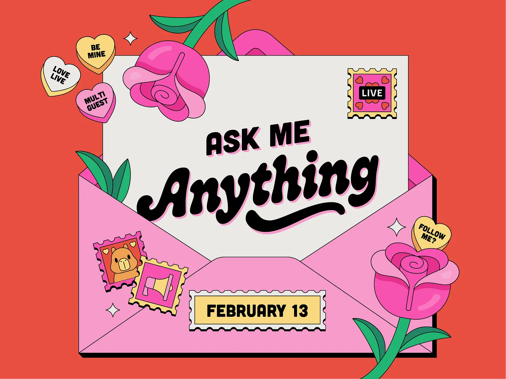

# Valentine's Day Landing Page 💕

A fun and interactive Valentine's Day landing page to ask that special someone to be your Valentine!



## Features

- **Beautiful Envelope Design** - Pink envelope with a letter popping out
- **Retro Cartoon Aesthetic** - Bold outlines, candy hearts, roses, and stamps
- **Interactive "No" Button** - The button escapes when you try to hover over it!
- **Celebration Effect** - Confetti and hearts rain down when "Yes" is clicked
- **Fully Responsive** - Works on desktop and mobile devices

## How It Works

1. Open the page and show it to your special someone
2. They'll see "Will You Be My Valentine?" with two buttons
3. If they try to click "No", the button runs away!
4. When they click "Yes", a celebration with confetti appears

## Getting Started

Simply open `index.html` in any web browser:

```bash
# Clone the repository
git clone https://github.com/YOUR_USERNAME/valentine.git

# Open in browser
start index.html  # Windows
open index.html   # macOS
```

Or use a local server:

```bash
# Using Python
python -m http.server 8000

# Using Node.js
npx serve
```

Then visit `http://localhost:8000`

## Customization

You can easily customize the page by editing `index.html`:

- **Change the message** - Edit the text in `.letter-text-top` and `.letter-text-main`
- **Change the date** - Update the date in `.date-badge`
- **Change colors** - Modify the CSS color values
- **Add her name** - Personalize the success message

## Technologies Used

- HTML5
- CSS3 (Animations, Flexbox)
- Vanilla JavaScript
- Google Fonts (Dancing Script, Poppins)

## License

Made with 💖 for love.

---

*Go get your Valentine!* 💕
